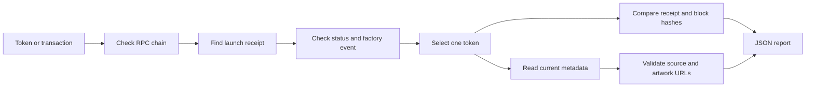

# From launch to source

## Receipt selection

An address triggers a backward log search, filtered by factory and indexed token.
Windows are contiguous, bounded and include both endpoints. The first matching
transaction becomes the candidate; its receipt must independently contain the
matching factory event. A supplied transaction hash skips log scanning.

Only `TokenLaunched` events emitted by the preset factory count. Malformed and
unrelated logs are ignored. Repeated events for the same token are deduplicated
case-insensitively. If a receipt launches multiple different tokens, the caller
must choose one. A selection absent from the receipt is rejected.

## Metadata semantics

The reader calls `name()`, `symbol()`, `description()` and `logo()` in parallel.
These are current reads, which may span different latest blocks. This preserves
the application's behavior on an RPC that prunes historical contract state.
No historical or atomic metadata snapshot is claimed.

The final line matching `Source NFT: ...` is used, preserving the application
convention. It must be exactly `https://zecbit.net/item/{collection}/{positive-id}`:
no query string, fragment, credentials, custom port or trailing slash. Multiple
references are not an ownership chain; only the final reference is reported.

Artwork must be an HTTPS URL without embedded credentials or a nondefault port.
The reader does not fetch or verify the image. Names and metadata are untrusted
text and must be escaped when displayed in HTML.

## What a passing report means

A successful RPC receipt contains a matching launch event, its reported block
still matches a separately fetched block, and current token metadata references
a syntactically supported NFT source. The chain can reorganize after the check;
no confirmation-depth or finality policy is enforced. An untrusted RPC can lie.

No NFT ownership, NFT authenticity, shielded Zcash data, economic safety or
permission from the original creator is established by these checks.

## Extraction notes

Based on Diamond Hand's `proof` and `verify-launch` modules. The standalone
version consolidates the duplicate receipt fetch, validates optional selection,
and deduplicates token identities before returning the same report schema.
Wallet integrations, launch-writing ABI methods, fee recipients and production
credentials are excluded. Tests use encoded synthetic EVM events and never call
a public RPC.
